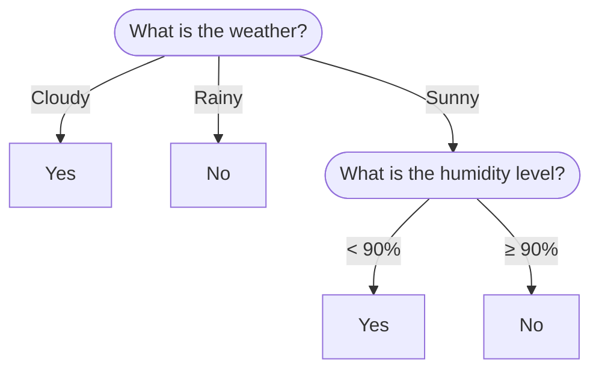

# Exercise: Baseball Match Decision

## Instructions

1. Create a file named `baseball.py`.
2. Design a program that determines if a baseball match can be played based on weather conditions.
3. **Logic Flow:**
   * **Cloudy:** The match is played.
   * **Rainy :** The match is postponed.
   * **Sunny :**
     * If humidity < 90%: The match is played.
     * If humidity ≥ 90%: The match is postponed.

## Constraints
1. **Input Order:** The program must ask **both** questions (Weather and Humidity) *before* making any decision or printing any error.
2. **Case Sensitivity:** The user can enter uppercase (N, E, P) or lowercase (n, e, p). Use `.lower()` or `.upper()`.
3. **Validation:**
   * Humidity must be an integer between 0 and 100.
   * Weather must be 'n', 'e', or 'p'.
   * If *any* input is invalid, print an error message: `==> Réponses incorrectes !`
4. **Output:** Display the result using specific messages (store these in constants).